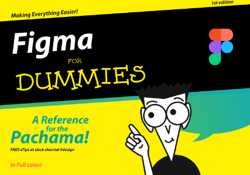

###### Intro
# Figma for Newbies <!-- Newbies make sriketrough texst here -->

<!-- cant use the image or the name as it has been done already -->

# Itroduction:
When I was itally introduced to [Figma](https://www.figma.com/), it felt to me like I was put in the dire's seat of a space ship. Seeing th user unterface I was taken back by what at the time seemed extremely complex. It was all a little scary, and mostly confusing, and I had doubts about ever being able to vreate something.

During this time I was working on a project and was completly bown away by the ting my colluges were able to make. Made outstanding page layouts, interesting animantions and fully interactive website desigs which gave off the appearcne the the user was inteacting with a live website. The level of detail they were able to achieve in designs made them seem like they have a PHD in Figma. Howere when i reached out to them for assitacne in the most asic things like navigating through the different pages they assured me that Figam is NOT hard to do. They assured me y learning th basics of Figma and maybe a little google-ing id be able to crate wonderful things in no time at all. 

This was integing and exciting to me. In just af few weeks i was able to not only learn my way around Figma but also create beautiful and mind bending things in figma. The truth is everything in this book can be found online in an open resource. The trick is knowing what to look for online and of course having time to do some reaserach.

### Why This book
In light of this and to help the next person out i have decided to create this resource. Saving you the time and fustrationof spending hours on end researching online resources to get acuanted with Figma and learn to to fantastic things with it. 

This book is a compalation of knowlege and skills i ahve gained in just little over a year designed to get you up-to-speed with using Figma and all of its wonderfull resources. In working your way trhough this book you will learn many tricks and tips in creating the best design you can imagine.

### What is Figma and what is it not?
Figma, in a nutshell, is a user friendly higly felxible desing software most commonly used by developers and designers to make a visual representations of a websites.

It is not limited to this functionailty and can be used to create beautiful product displays and so much more. It has the ability to create simple animations wihtout being voerly complex. 

Its versatility allows it to be adapted to many applications like creating designs, vector graphics, images, layouts, documents, and more. Although Figma might not be class leading in all of the mentioned catagories it compact wonderfully into a signle system which is easy to use and powerful enoug to impress. 

#### What its not:
- **Animation Sotware** - Although Figma can handle simple animations its system was never designed with anamatrinocs in mind.
- **CAD Sofware** - This product is not intended to be used as a CAD software, but i have see designs made using figma which looked qute compelling.

- **A Document Handler** - Figma can create beautiful design for documents and allows for easy layout and designs. However Figma is not a document handler like the likes of word or office.

- **An Imgae manipulator Software** Figma allows for user to create designs with ease and its interface  allows for some image manipluation but it does not pack the same punch as dedicated image manipulator software like corel.

### Why Do we use figma?
Figma is a powerfull FREE design software wich allows user to create and share design ideas easily. With built in functionalites clients can easily view and comment designs right in the design file itself. Figma also provides support for developers creating html code snippets for features making implementing the design much quicker.

### How to get started 
To get sdtarted got to [figma.com](www.figma.com) and register a user profile. It's free and will allow you to create and save your work.

### Key Consepts you'll learn
Some key conseps youll learn from this book include the following:

* Tool and elements
* How to create frames, components and simple animatations
* How to share your figma file with other to receive feedback on your design
* How to create a wireframe
* Complex designs - Create weird shapes and things from scratch
* Complex and timed animations. Make your desig stand out
* plugins - how to get the best out of figma
* creating styles and themes

### Project and files
Ideally, starting from scratch provides abetter learning experience. However if you would like to use the same files i use in my designs the resourcess can be found [here]()
