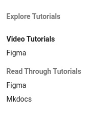
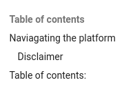
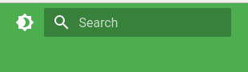

# **Explore**

The content on this platform is devided into two main sections:

The document tutorials section, whic provides users with read through tutorial documentation.
The video tutorials section, which provides users with the oppertunity to wach a video tutorial.

### Naviagating the platform

There are 4 main ways of navigating on the platform and finding content you may want to view:

|   |   |   |
|---|---|---|
| 1.  |   | Top Navbar  |
| 2.  |   | Left Navigational Pane  |
| 3.  |   | Table of conents  |
| 4.  |   | Search-bar  |

> **Note:** *The sun icon next to the searchbar enables you to toggle the page to darkmode*

#### Disclaimer
All content of this platform is for educational purposes only. We do not take any respinsability and cannot be held liable for any damages you may incur caused while utelising this product.

<!-- might want to exchange this with a table a some point -->

### Table of contents:
Below is a list of documentation availible on this paltform:

- [Figma](/docs/src/figma/index.md)
- [Mkdocs](/docs/src/mkdocs/index.md)